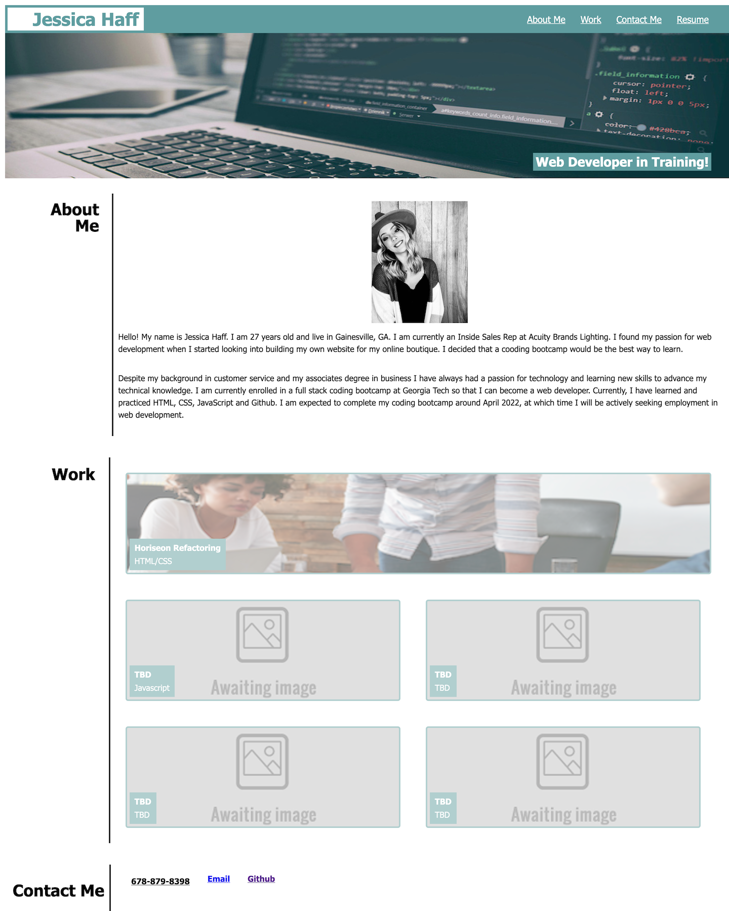

# advanced-css-portfolio-2

## 02 Advanced CSS: Portfolio

### Description:
#### This homework is a professional portfolio created and completed by Jessica Haff. This portfolio will be used to showcase my skills and talents to potential employers. This portfolio will be developed throughout this course to highlight my strongest work.
<br>
<br>

### Acceptance Criteria
```
GIVEN I need to sample a potential employee's previous work
WHEN I load their portfolio
THEN I am presented with the developer's name, a recent photo or avatar, and links to sections about them, their work, and how to contact them
WHEN I click one of the links in the navigation
THEN the UI scrolls to the corresponding section
WHEN I click on the link to the section about their work
THEN the UI scrolls to a section with titled images of the developer's applications
WHEN I am presented with the developer's first application
THEN that application's image should be larger in size than the others
WHEN I click on the images of the applications
THEN I am taken to that deployed application
WHEN I resize the page or view the site on various screens and devices
THEN I am presented with a responsive layout that adapts to my viewport
```
<br>
<br>

### Tasks Completed
```
- HTML: Document created. Semantic HTML elements were utilized.  
- HTML: Comments were added to the index page

- CSS: Organized style sheet to follow a logical structure
- CSS: Comments were added to the index page
```

### Links
[Link to Live Webpage](https://jesshaff.github.io/advanced-css-portfolio-2/) 

[Link to Github Repository](https://github.com/jesshaff/advanced-css-portfolio-2)

### Screenshots
## -Portfolio Mockup-


<br>

## -My Portfolio-


